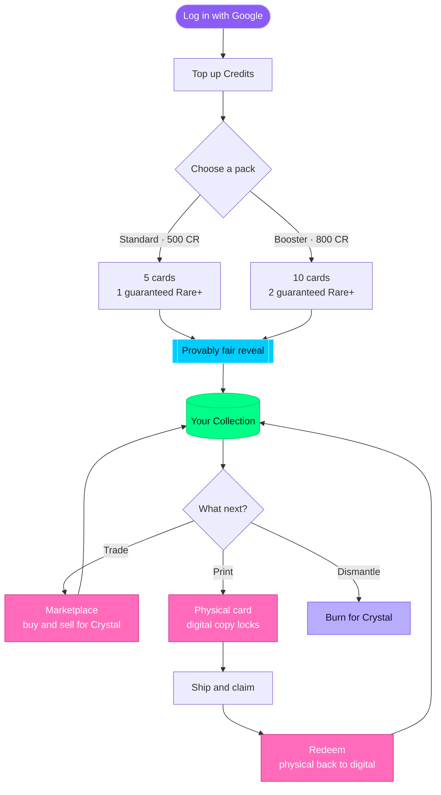
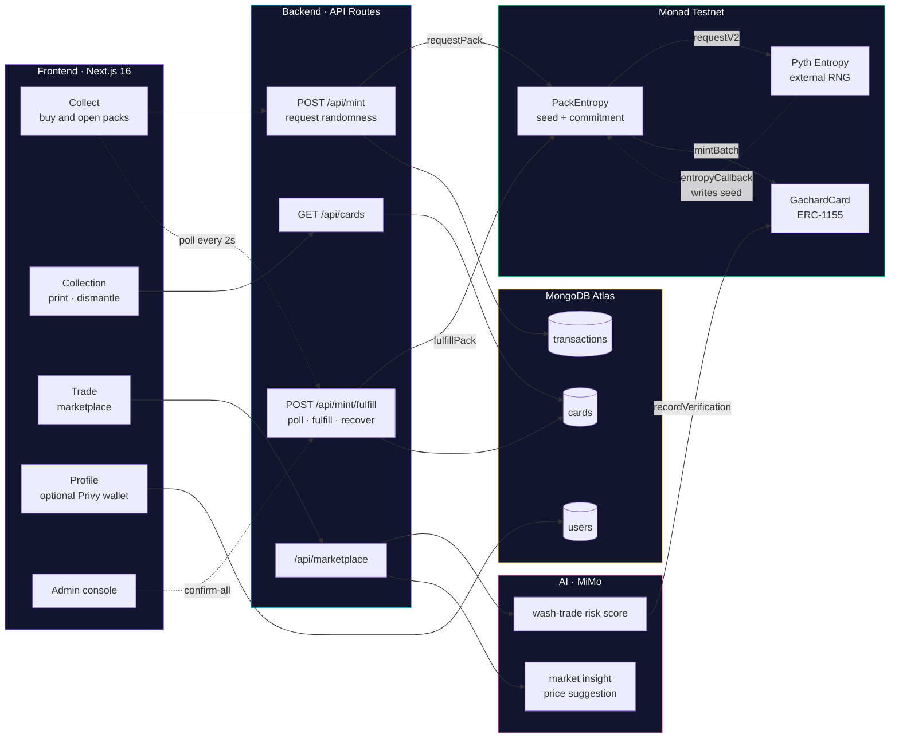
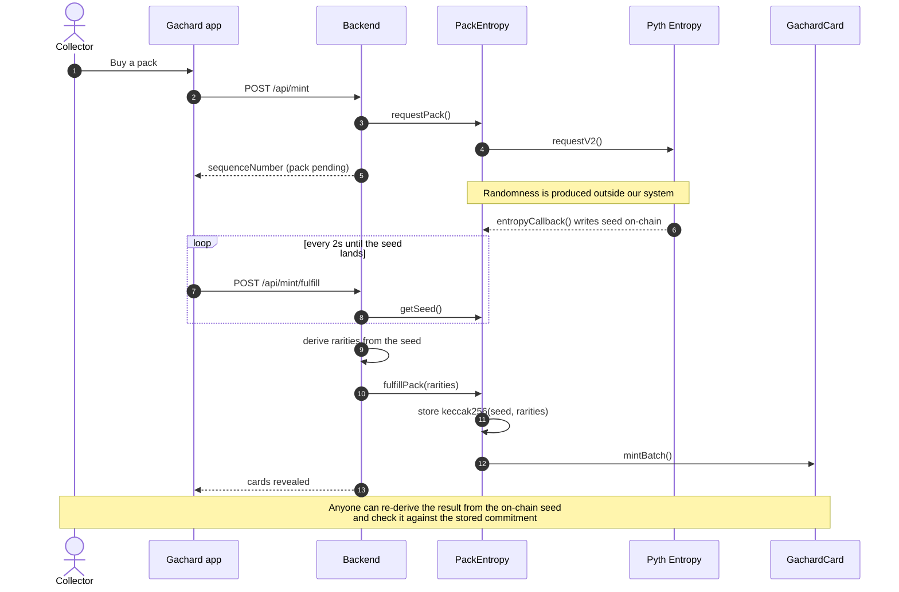
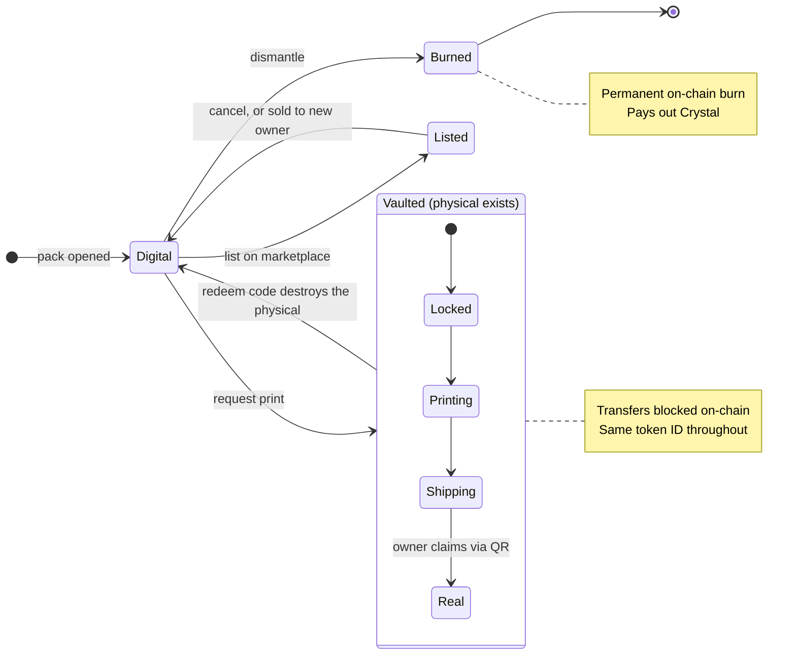

# Gachard on Monad

A digital-native collectible card game (TCG) platform built on **Monad Testnet**. Brands and IP owners can issue cards that users buy, collect, print as physical cards, and redeem back to digital, with blockchain completely hidden from the end user.

Monad's sub-second blocks make it viable to treat a pack opening as a synchronous, consumer-grade interaction. Measured block time on Monad Testnet is **~0.3s** (sampled over 2,000 blocks), which is what lets `mintBatch()` confirm inside the reveal animation rather than behind a pending spinner. Monad reports throughput of ~10,000 TPS; we have not independently measured that.

## Live Demo

- **App**: https://gachard-monad.vercel.app
- **Admin Console**: https://gachard-monad.vercel.app/admin
- **Smart Contract (GachardCard):** [0x2a05a2e3b0e7355b97de593e354063e9474c9d08](https://testnet.monadvision.com/address/0x2a05a2e3b0e7355b97de593e354063e9474c9d08) (verified on Sourcify)
- **Smart Contract (PackEntropy):** [0x6B53C35e8baBaaBe4DD725573C3f612121764542](https://testnet.monadvision.com/address/0x6B53C35e8baBaaBe4DD725573C3f612121764542) (verified on Sourcify)

## Features

### Core Loop



### Technical Architecture



### Pack Opening, Step by Step

A pack is three separate transactions, and the randomness arrives from outside our
system in the middle of them. This is what makes the result checkable by anyone.



### Card Lifecycle



### Core Loop Detail
- **Login**: Google OAuth + demo account (custodial wallet, hidden from user)
- **Buy Pack**: Standard (5 cards / 500 Credits) or Booster (10 cards / 800 Credits)
- **Collect**: NFT cards minted on-chain, stored in user's collection
- **Print**: Physical card printing (+$14.99 shipping), card locked in vault
- **Claim Shipping**: User scans QR code on receipt → status becomes "Real"
- **Redeem**: Enter Card ID + Redeem Code from physical card → back to digital

### Additional Features
- **Scan & Verify**: QR code scanning for card authenticity verification
- **Credit System**: Top up credits to purchase packs
- **Transaction History**: Full transaction history in Profile page
- **Unique Card ID**: Each card has a unique hex ID (e.g. `#8a866`)
- **Invoice ID**: Each transaction has an Invoice ID (e.g. `GC-20260730-a3f1`)
- **Admin Console**: Manage users, transactions, cards, print requests, monitor MON balances. Every tab has search, filters and sorting matched to what that tab is for
- **Trade Marketplace**: Buy/sell cards between users with FVM pricing
- **Dismantle & Crystal**: Burn cards to earn Crystal currency
- **AI Anomaly Detection**: Wash-trading detection on marketplace
- **Support Gachard**: Floating CTA for early supporters, shown on the homepage only
- **Pyth Entropy**: Provably fair pack randomness with on-chain verifiable RNG
- **Privy Embedded Wallet**: Optional self-custody wallet for advanced users (For Advanced Users section)

## Quick Start

### Prerequisites
- Node.js 18+
- MongoDB Atlas account (free tier)
- Google Cloud Console OAuth credentials

### Frontend + Backend (Single Service)
```bash
cd frontend
npm install
npm run dev
```

Backend runs via Next.js API routes (`app/api/`), no separate service needed.

### Smart Contracts (Foundry)
```bash
cd contracts
forge install
forge build
forge test
```

### Environment Variables
Copy [`frontend/.env.local.example`](frontend/.env.local.example) to
`frontend/.env.local` and fill it in. Each variable is annotated there, and the
deployment-specific notes are in [Deployment → Frontend (Vercel)](#frontend-vercel).

## Stack

| Layer | Technology |
|-------|-----------|
| Frontend | Next.js 16 (App Router), React 19, Tailwind CSS 4 |
| Backend | Next.js API Routes (single service) |
| Database | MongoDB Atlas (free tier) |
| Blockchain | Monad Testnet, ERC-1155 |
| Smart Contracts | Solidity 0.8.28, Foundry, OpenZeppelin v5 |
| Wallet | Custodial (ethers.js v6), sponsored gas |
| Auth | Google OAuth + demo accounts |
| Payment | Simulated checkout (demo), no payment processor integrated |
| AI | MiMo LLM (trade risk scoring, market insight, price suggestion) |
| RNG | Pyth Entropy (on-chain verifiable) |
| Wallet (optional) | Privy Embedded Wallet (self-custody, v1.93.0) |
| Hosting | Vercel (frontend + backend) |

## Architecture

### Key Design Decisions
- **ADR-002**: Custodial wallet, hidden from user
- **ADR-003**: Gas fees sponsored by platform
- **ADR-004**: Lock in-place via status flag (not burn)
- **ADR-017**: Next.js API routes as sole backend
- **ADR-018**: Async pattern for blockchain transactions
- **ADR-020**: AES-256-GCM encryption for private keys
- **ADR-024**: Functional marketplace (trade system)
- **ADR-025**: AI Anomaly Detection Oracle
- **ADR-026**: Dismantle & Crystal (burn-to-earn)
- **ADR-027**: Become a Creator (whitelist form)
- **ADR-028**: Privy Integration (optional self-custody wallet)
- **ADR-029**: Pyth Entropy for provably fair pack randomness
- **ADR-030**: MiMo as the single AI provider

The full ADR log is in [`DECISIONS.md`](DECISIONS.md), 30 records covering every
architectural decision, including the ones that were superseded and the known
limitations of each. The two largest decisions also have dedicated specs:

- [`docs/ENTROPY-INTEGRATION-SPEC.md`](docs/ENTROPY-INTEGRATION-SPEC.md), the provably-fair
  pack randomness design: request/callback/fulfill flow, hash commitment, threat model
- [`docs/PRIVY-EVALUATION.md`](docs/PRIVY-EVALUATION.md) and
  [`docs/PRIVY-INTEGRATION-SPEC.md`](docs/PRIVY-INTEGRATION-SPEC.md), the self-custody
  wallet evaluation and the resulting progressive-disclosure design

### Project Structure
```
gachard-monad/
├── frontend/           # Next.js app (single service)
│   ├── app/           # Pages & API routes
│   ├── components/    # React components
│   ├── lib/           # Utilities & blockchain
│   ├── hooks/         # React hooks
│   └── public/        # Static assets
├── contracts/         # Solidity smart contracts (Foundry)
│   ├── src/           # GachardCard.sol + PackEntropy.sol
│   ├── test/          # 78 test cases
│   └── script/        # Deploy scripts
├── docs/              # Documentation
├── scripts/           # Deployment scripts
├── MEMORY.md          # Project status & working notes (not published)
├── DECISIONS.md       # Architecture decisions, 30 ADRs
```

## Deployment

### Smart Contract (Monad Testnet)
```bash
# Auto-generate wallet and deploy
deploy-auto.bat

# Or manually with Foundry
cd contracts
forge create src/GachardCard.sol:GachardCard \
  --rpc-url https://testnet-rpc.monad.xyz \
  --private-key <YOUR_PRIVATE_KEY> \
  --chain-id 10143

# Deploy PackEntropy (auto-authorizes as minter)
forge script script/DeployPackEntropy.s.sol --rpc-url monad_testnet --broadcast
```

### Frontend (Vercel)
1. Push to `main` branch → auto-deploy
2. Settings:
   - Framework Preset: Next.js
   - Root Directory: `frontend`
3. Environment Variables:
   - `MONGODB_URL`: MongoDB Atlas connection string
   - `DATABASE_NAME`: gachard
   - `GOOGLE_CLIENT_ID`: Google OAuth Client ID
   - `GOOGLE_CLIENT_SECRET`: Google OAuth Client Secret
   - `CONTRACT_ADDRESS`: GachardCard contract address
   - `ENTROPY_CONTRACT_ADDRESS`: PackEntropy contract address (for on-chain RNG)
   - `PYTH_ENTROPY_ADDRESS`: Pyth Entropy contract address (Monad Testnet)
   - `ADMIN_WALLET_ADDRESS`: Admin wallet address
   - `ADMIN_PRIVATE_KEY`: Admin wallet private key
   - `RPC_URL`: Monad Testnet RPC URL
   - `CHAIN_ID`: Monad Testnet Chain ID (10143)
   - `ENCRYPTION_SECRET_KEY`: AES-256-GCM key (min 32 chars)
    - `ADMIN_USERNAME` / `ADMIN_PASSWORD`, Admin console credentials
    - `NEXT_PUBLIC_PRIVY_APP_ID`: Privy App ID for embedded wallet (optional)
   - `NEXT_PUBLIC_CONTRACT_ADDRESS`: GachardCard address for client-side links (admin panel)
   - `MIMO_API_KEY`: MiMo LLM key. **Required for AI features.** Without it, trade risk
     scoring and market insight silently return "AI scoring unavailable" instead of failing

### Database Scripts
```bash
# Clean slate (delete all test data)
cd frontend && npx tsx scripts/clean-slate.ts
```

## Blockchain Verification

All blockchain transactions are verifiable on Monad Explorer:
- **GachardCard**: [0x2a05a2e3b0e7355b97de593e354063e9474c9d08](https://testnet.monadvision.com/address/0x2a05a2e3b0e7355b97de593e354063e9474c9d08)
- **PackEntropy**: [0x6B53C35e8baBaaBe4DD725573C3f612121764542](https://testnet.monadvision.com/address/0x6B53C35e8baBaaBe4DD725573C3f612121764542)
- **Chain**: Monad Testnet (Chain ID 10143)
- **Explorer**: https://testnet.monadvision.com
- **Verification**: Sourcify exact_match ✅
- **Pack Verification**: `/api/verify/pack/[txHash]`, verify rarity fairness on-chain

### Admin Console Features
- **Balance Monitoring**: Real-time MON balance for admin wallet (gas) and PackEntropy (entropy fee)
- **Copy Address**: One-click copy for contract addresses with visual feedback
- **Transaction Tracking**: All transactions with clickable txHash links to Monad Explorer
- **User Wallets**: View user wallet addresses
- **Token IDs**: Track NFT tokens on blockchain
- **Risk Scores**: AI anomaly detection results

## Smart Contract Tests

```
Ran 2 test suites: 78 tests passed, 0 failed, 0 skipped (78 total tests)
Compiler: Solc 0.8.28 + EVM cancun + via_ir
```

Test coverage: mint, print, redeem, transfer, burn, verification, access control, events, error handling, Pyth Entropy integration (20 tests).

## Pyth Entropy Integration

Pack rarity is determined by **Pyth Entropy**, an on-chain verifiable RNG protocol on Monad Testnet. This replaces `Math.random()` with a 4-layer security model:

1. **Access Control**: Only authorized contracts can request/fulfill entropy
2. **Hash Commitment**: `keccak256(seed, rarities)` stored on-chain creates immutable binding
3. **Structural Check**: On-chain validation ensures minimum Rare+ card count
4. **Transparency**: Public verification endpoint at `/api/verify/pack/[txHash]`

### Verifying a Pack Yourself

Nothing here has to be taken on trust. The seed and the commitment are both
public on-chain, so anyone can re-derive a pack's result and check it:

```bash
cd frontend && npx tsx scripts/verify-entropy-onchain.ts
```

It reads `getSeed(seq)` from the chain, recomputes the rarities with the
deterministic shuffle, recomputes `keccak256(seed, rarities)`, and compares that
against the `getRarityHash(seq)` stored on-chain, then cross-checks each minted
token's `cardRarity()` and the Rare+ guarantee. Run against 9 live transactions:
9 passed, 0 failed.

The one thing the commitment does *not* prove is that the shuffle algorithm
itself is unbiased. It proves the rarities were derived consistently from that
seed. Closing that gap means moving the shuffle on-chain, at roughly 150k-200k
extra gas per pack. That trade-off is recorded in ADR-029.

### Recovering an Interrupted Pack

Pack opening spans three transactions (request → Pyth callback → fulfill), so it
can be interrupted between them. Recovery is on-chain-first: before doing
anything, the endpoint asks the contract whether the sequence is already
fulfilled, and if so reconstructs state from the chain rather than re-minting.

Finding the `PackFulfilled` event for that reconstruction is anchored to
`entropyRequestBlock`, the block the request landed in, captured from its
receipt. Fulfillment can only occur at or after it, so the log scan runs forward
from a known point and normally resolves in a single query. Scanning backwards
from the chain head instead would be bounded by Monad's 100-block `eth_getLogs`
cap and the 10s route budget to roughly ten minutes of history, which is shorter
than the hour a client keeps a timed-out pack recoverable.

### Cost per Pack Opening
| Pack Type | Gas (Admin) | Entropy Fee (PackEntropy) | Total |
|-----------|-------------|---------------------------|-------|
| Standard (5 cards) | ~0.003 MON | ~0.03 MON | ~0.033 MON |
| Booster (10 cards) | ~0.005 MON | ~0.03 MON | ~0.035 MON |

All costs are sponsored by the platform. Users only pay with Credits.

## Roadmap

### True Digital Ownership (Planned)

Building on the self-custody wallet foundation (Privy integration, currently live as a view-only "For Advanced Users" section), we are exploring the ability to let users export their cards to their own wallet, which would give them full, verifiable ownership outside the Gachard platform.

Under this planned feature, cards could later be brought back into the Gachard ecosystem (re-imported) to resume in-app features such as marketplace trading, printing, and dismantling. This would complete the loop between custodial simplicity and true blockchain ownership, letting users choose their own level of control.

**Current status:** Self-custody wallet creation and address verification are live. Card export and re-import are planned, not yet implemented.

### AI Vision Verification (Planned)

AI-powered visual card analysis is planned as a complementary verification layer alongside the existing QR-based on-chain lookup, comparing a photographed card against its on-chain template to catch forgeries that carry a valid-looking QR code.

**Current status:** Not implemented. No vision code exists yet. QR-based verification is the only method today. The AI that *is* live is text-based: trade risk scoring and marketplace insight, both via MiMo.

## Notes for AI Coding Agents
- Read `DECISIONS.md` and `docs/` before making changes (`MEMORY.md` is not published)
- Do not use blockchain/crypto/on-chain terminology in user-facing UI
- All changes must be compatible with locked ADRs
- Test on mobile (iPhone 12 Pro/390px, Galaxy S8+/360px) before deploying
- Use `getAuthenticatedUser(req)` for all API routes (server-side session)
- All blockchain transactions use async pattern (ADR-018)

## License
Private, Monad hackathon submission.
