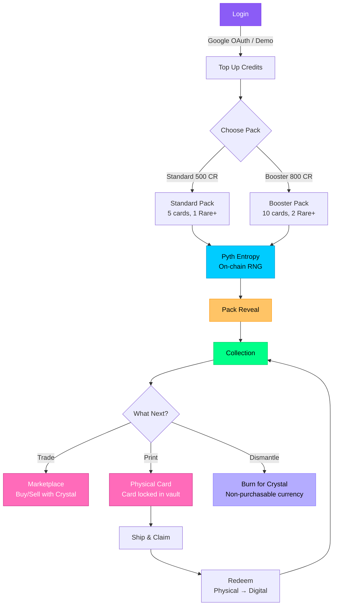
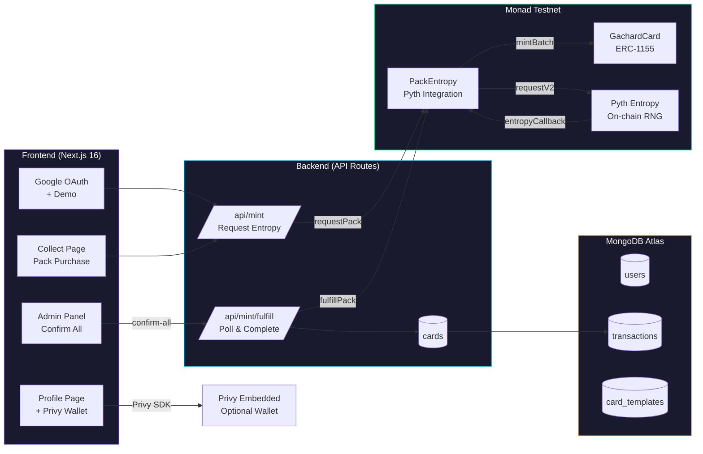
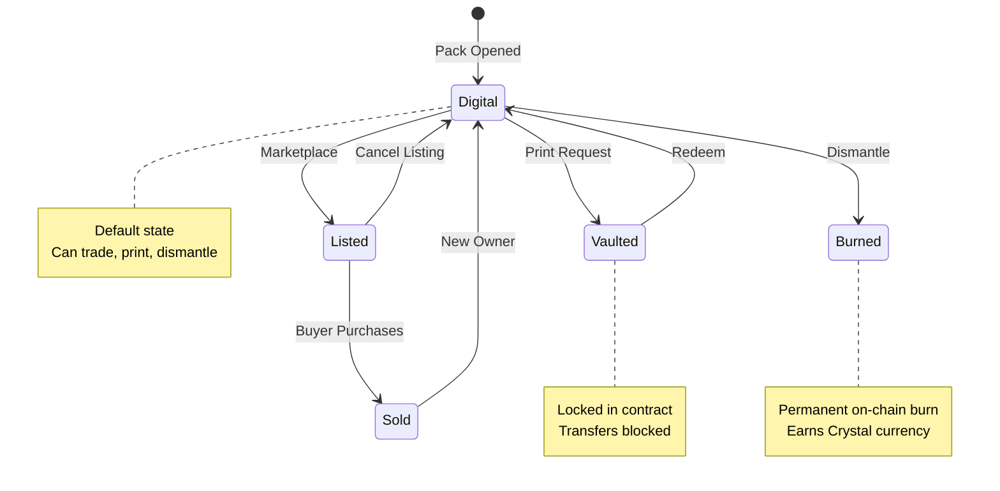

# Gachard on Monad

A digital-native collectible card game (TCG) platform built on **Monad Testnet**. Brands and IP owners can issue cards that users buy, collect, print as physical cards, and redeem back to digital — with blockchain completely hidden from the end user.

Monad's high throughput (~10,000 TPS) and low latency (~1s block time) make it ideal for a responsive TCG experience where mint, trade, and marketplace operations feel instant.

## Live Demo

- **App**: https://gachard-monad.vercel.app
- **Admin Console**: https://gachard-monad.vercel.app/admin
- **Smart Contract (GachardCard):** [0x2a05a2e3b0e7355b97de593e354063e9474c9d08](https://testnet.monadvision.com/address/0x2a05a2e3b0e7355b97de593e354063e9474c9d08) (verified on Sourcify)
- **Smart Contract (PackEntropy):** [0x6B53C35e8baBaaBe4DD725573C3f612121764542](https://testnet.monadvision.com/address/0x6B53C35e8baBaaBe4DD725573C3f612121764542) (verified on Sourcify)

## Features

### Core Loop



### Technical Architecture



### Card Lifecycle



### Additional Features
- **Login** — Google OAuth + demo account (custodial wallet, hidden from user)
- **Buy Pack** — Standard (5 cards / 500 Credits) or Booster (10 cards / 800 Credits)
- **Collect** — NFT cards minted on-chain, stored in user's collection
- **Print** — Physical card printing (+$14.99 shipping), card locked in vault
- **Claim Shipping** — User scans QR code on receipt → status becomes "Real"
- **Redeem** — Enter Card ID + Redeem Code from physical card → back to digital

### Additional Features
- **Scan & Verify** — QR code scanning for card authenticity verification
- **Credit System** — Top up credits to purchase packs
- **Transaction History** — Full transaction history in Profile page
- **Unique Card ID** — Each card has a unique hex ID (e.g. `#8a866`)
- **Invoice ID** — Each transaction has an Invoice ID (e.g. `GC-20260730-a3f1`)
- **Admin Console** — Manage users, transactions, cards, print requests, monitor MON balances
- **Trade Marketplace** — Buy/sell cards between users with FVM pricing
- **Dismantle & Crystal** — Burn cards to earn Crystal currency
- **AI Anomaly Detection** — Wash-trading detection on marketplace
- **Support Gachard** — Floating CTA button for early supporters
- **Pyth Entropy** — Provably fair pack randomness with on-chain verifiable RNG
- **Privy Embedded Wallet** — Optional self-custody wallet for advanced users (For Advanced Users section)

## Quick Start

### Prerequisites
- Node.js 18+
- MongoDB Atlas account (free tier)
- Google Cloud Console OAuth credentials

### Frontend + Backend (Single Service)
```bash
cd frontend
npm install
npm run dev
```

Backend runs via Next.js API routes (`app/api/`) — no separate service needed.

### Smart Contracts (Foundry)
```bash
cd contracts
forge install
forge build
forge test
```

### Environment Variables
See `frontend/.env.local.example`.

## Stack

| Layer | Technology |
|-------|-----------|
| Frontend | Next.js 16 (App Router), React 19, Tailwind CSS 4 |
| Backend | Next.js API Routes (single service) |
| Database | MongoDB Atlas (free tier) |
| Blockchain | Monad Testnet, ERC-1155 |
| Smart Contracts | Solidity 0.8.28, Foundry, OpenZeppelin v5 |
| Wallet | Custodial (ethers.js v6), sponsored gas |
| Auth | Google OAuth + demo accounts |
| Payment | Stripe Test Mode (credit + direct) |
| AI | Gemini API (market insight) |
| RNG | Pyth Entropy (on-chain verifiable) |
| Wallet (optional) | Privy Embedded Wallet (self-custody, v1.93.0) |
| Hosting | Vercel (frontend + backend) |

## Architecture

### Key Design Decisions
- **ADR-002**: Custodial wallet, hidden from user
- **ADR-003**: Gas fees sponsored by platform
- **ADR-004**: Lock in-place via status flag (not burn)
- **ADR-017**: Next.js API routes as sole backend
- **ADR-018**: Async pattern for blockchain transactions
- **ADR-020**: AES-256-GCM encryption for private keys
- **ADR-024**: Functional marketplace (trade system)
- **ADR-025**: AI Anomaly Detection Oracle
- **ADR-026**: Dismantle & Crystal (burn-to-earn)
- **ADR-027**: Become a Creator (whitelist form)
- **ADR-028**: Pyth Entropy for provably fair pack randomness
- **ADR-029**: Privy Integration (optional self-custody wallet)

See `DECISIONS.md` for all 29 ADRs.

### Project Structure
```
gachard-monad/
├── frontend/           # Next.js app (single service)
│   ├── app/           # Pages & API routes
│   ├── components/    # React components
│   ├── lib/           # Utilities & blockchain
│   ├── hooks/         # React hooks
│   └── public/        # Static assets
├── contracts/         # Solidity smart contracts (Foundry)
│   ├── src/           # GachardCard.sol + PackEntropy.sol
│   ├── test/          # 76 test cases
│   └── script/        # Deploy scripts
├── docs/              # Documentation
├── scripts/           # Deployment scripts
├── MEMORY.md          # Project status & rules
├── DECISIONS.md       # Architecture decisions (28 ADRs)
└── vercel.json        # Vercel deployment config
```

## Deployment

### Smart Contract (Monad Testnet)
```bash
# Auto-generate wallet and deploy
deploy-auto.bat

# Or manually with Foundry
cd contracts
forge create src/GachardCard.sol:GachardCard \
  --rpc-url https://testnet-rpc.monad.xyz \
  --private-key <YOUR_PRIVATE_KEY> \
  --chain-id 10143

# Deploy PackEntropy (auto-authorizes as minter)
forge script script/DeployPackEntropy.s.sol --rpc-url monad_testnet --broadcast
```

### Frontend (Vercel)
1. Push to `main` branch → auto-deploy
2. Settings:
   - Framework Preset: Next.js
   - Root Directory: `frontend`
3. Environment Variables:
   - `MONGODB_URL` — MongoDB Atlas connection string
   - `DATABASE_NAME` — gachard-monad
   - `GOOGLE_CLIENT_ID` — Google OAuth Client ID
   - `GOOGLE_CLIENT_SECRET` — Google OAuth Client Secret
   - `CONTRACT_ADDRESS` — GachardCard contract address
   - `ENTROPY_CONTRACT_ADDRESS` — PackEntropy contract address (for on-chain RNG)
   - `PYTH_ENTROPY_ADDRESS` — Pyth Entropy contract address (Monad Testnet)
   - `ADMIN_WALLET_ADDRESS` — Admin wallet address
   - `ADMIN_PRIVATE_KEY` — Admin wallet private key
   - `RPC_URL` — Monad Testnet RPC URL
   - `CHAIN_ID` — Monad Testnet Chain ID (10143)
   - `ENCRYPTION_SECRET_KEY` — AES-256-GCM key (min 32 chars)
    - `ADMIN_USERNAME` / `ADMIN_PASSWORD` — Admin console credentials
    - `NEXT_PUBLIC_PRIVY_APP_ID` — Privy App ID for embedded wallet (optional)

### Database Scripts
```bash
# Clean slate (delete all test data)
cd frontend && npx tsx scripts/clean-slate.ts
```

## Blockchain Verification

All blockchain transactions are verifiable on Monad Explorer:
- **GachardCard**: [0x2a05a2e3b0e7355b97de593e354063e9474c9d08](https://testnet.monadvision.com/address/0x2a05a2e3b0e7355b97de593e354063e9474c9d08)
- **PackEntropy**: [0x6B53C35e8baBaaBe4DD725573C3f612121764542](https://testnet.monadvision.com/address/0x6B53C35e8baBaaBe4DD725573C3f612121764542)
- **Chain**: Monad Testnet (Chain ID 10143)
- **Explorer**: https://testnet.monadvision.com
- **Verification**: Sourcify exact_match ✅
- **Pack Verification**: `/api/verify/pack/[txHash]` — verify rarity fairness on-chain

### Admin Console Features
- **Balance Monitoring** — Real-time MON balance for admin wallet (gas) and PackEntropy (entropy fee)
- **Copy Address** — One-click copy for contract addresses with visual feedback
- **Transaction Tracking** — All transactions with clickable txHash links to Monad Explorer
- **User Wallets** — View user wallet addresses
- **Token IDs** — Track NFT tokens on blockchain
- **Risk Scores** — AI anomaly detection results

## Smart Contract Tests

```
Ran 76 tests — 76 passed, 0 failed, 0 skipped
Compiler: Solc 0.8.28 + EVM cancun + via_ir
```

Test coverage: mint, print, redeem, transfer, burn, verification, access control, events, error handling, Pyth Entropy integration (18 tests).

## Pyth Entropy Integration

Pack rarity is determined by **Pyth Entropy**, an on-chain verifiable RNG protocol on Monad Testnet. This replaces `Math.random()` with a 4-layer security model:

1. **Access Control** — Only authorized contracts can request/fulfill entropy
2. **Hash Commitment** — `keccak256(seed, rarities)` stored on-chain creates immutable binding
3. **Structural Check** — On-chain validation ensures minimum Rare+ card count
4. **Transparency** — Public verification endpoint at `/api/verify/pack/[txHash]`

### Cost per Pack Opening
| Pack Type | Gas (Admin) | Entropy Fee (PackEntropy) | Total |
|-----------|-------------|---------------------------|-------|
| Standard (5 cards) | ~0.003 MON | ~0.03 MON | ~0.033 MON |
| Booster (10 cards) | ~0.005 MON | ~0.03 MON | ~0.035 MON |

All costs are sponsored by the platform — users only pay with Credits.

## Roadmap

### True Digital Ownership (Planned)

Building on the self-custody wallet foundation (Privy integration, currently live as a view-only "For Advanced Users" section), we are exploring the ability to let users export their cards to their own wallet — giving them full, verifiable ownership outside the Gachard platform.

Under this planned feature, cards could later be brought back into the Gachard ecosystem (re-imported) to resume in-app features such as marketplace trading, printing, and dismantling. This would complete the loop between custodial simplicity and true blockchain ownership, letting users choose their own level of control.

**Current status:** Self-custody wallet creation and address verification are live. Card export and re-import are planned — not yet implemented.

### AI Vision Verification (Planned)

AI-powered visual card analysis (Google Gemini) is planned as a complementary verification layer alongside the existing QR-based on-chain lookup. This is a required eligibility criterion for the hackathon's "AI x Web3" theme and is targeted for completion before the final submission deadline.

**Current status:** Reference code exists in `lib/vision.ts` but is not active. QR-based verification is the current method.

## Notes for AI Coding Agents
- Read `MEMORY.md`, `DECISIONS.md`, and `docs/` before making changes
- Do not use blockchain/crypto/on-chain terminology in user-facing UI
- All changes must be compatible with locked ADRs
- Test on mobile (iPhone 12 Pro/390px, Galaxy S8+/360px) before deploying
- Use `getAuthenticatedUser(req)` for all API routes (server-side session)
- All blockchain transactions use async pattern (ADR-018)

## License
Private — Monad hackathon submission.
